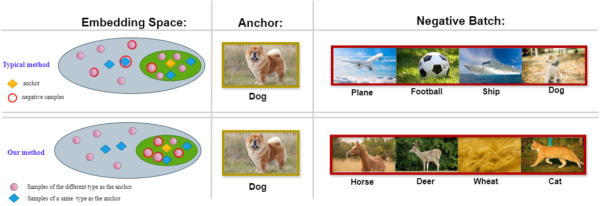
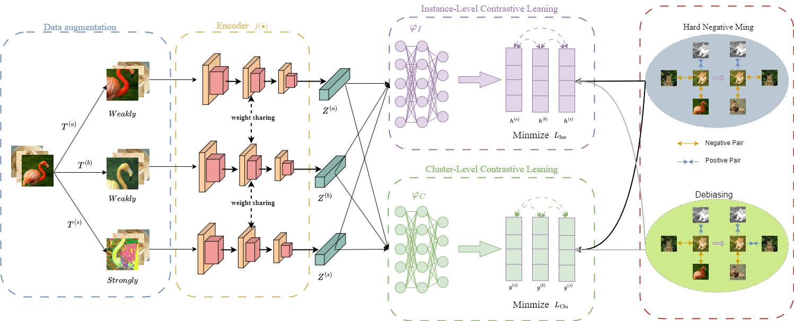

This is a Pytorch implementation of the paper. ()

## Performance

The representation encoder of the proposed CCL-HD is ResNet34.

|    Dataset    | NMI  | ACC  | ARI  |
| :-----------: | :--: | :--: | :--: |
|   CIFAR-10    | 70.3 | 80.2 | 66.0 |
|   CIFAR-100   | 49.3 | 47.7 | 32.8 |
|  ImageNet-10  | 88.0 | 94.6 | 88.5 |
| ImageNet-dogs | 47.3 | 45.3 | 32.1 |

## Dependency

- python>=3.7
- pytorch>=1.6.0
- torchvision>=0.8.1
- munkres>=1.1.4
- numpy>=1.19.2
- opencv-python>=4.4.0.46
- pyyaml>=5.3.1
- scikit-learn>=0.23.2
- cudatoolkit>=11.0

## Configuration

There is a configuration file "config/config.yaml", where one can edit both the training and test options.# CCL-HD
This is the relevant code for my thesis.
# CCL-HD
